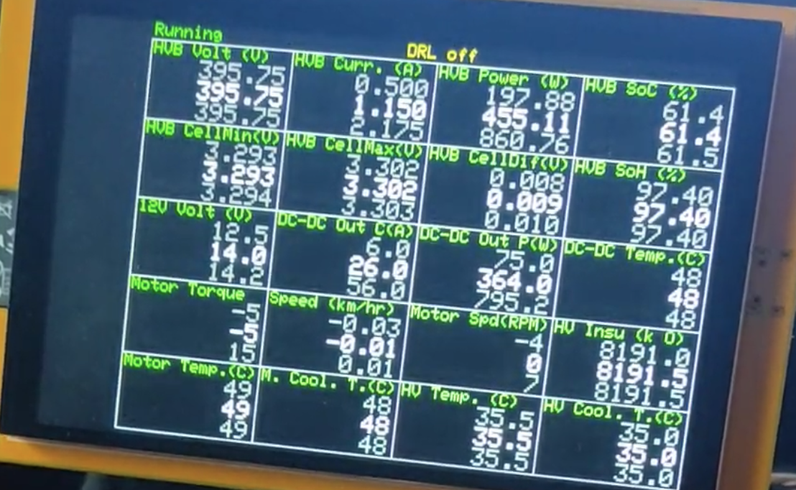
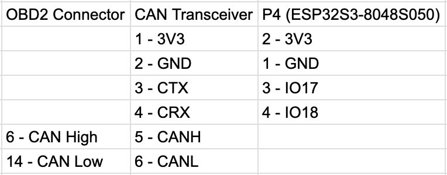
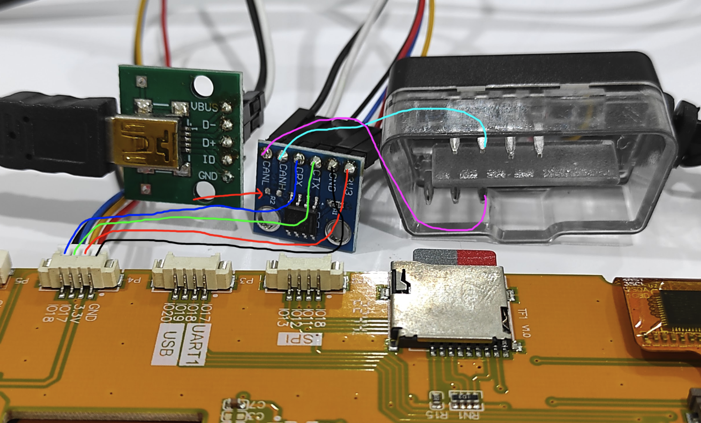
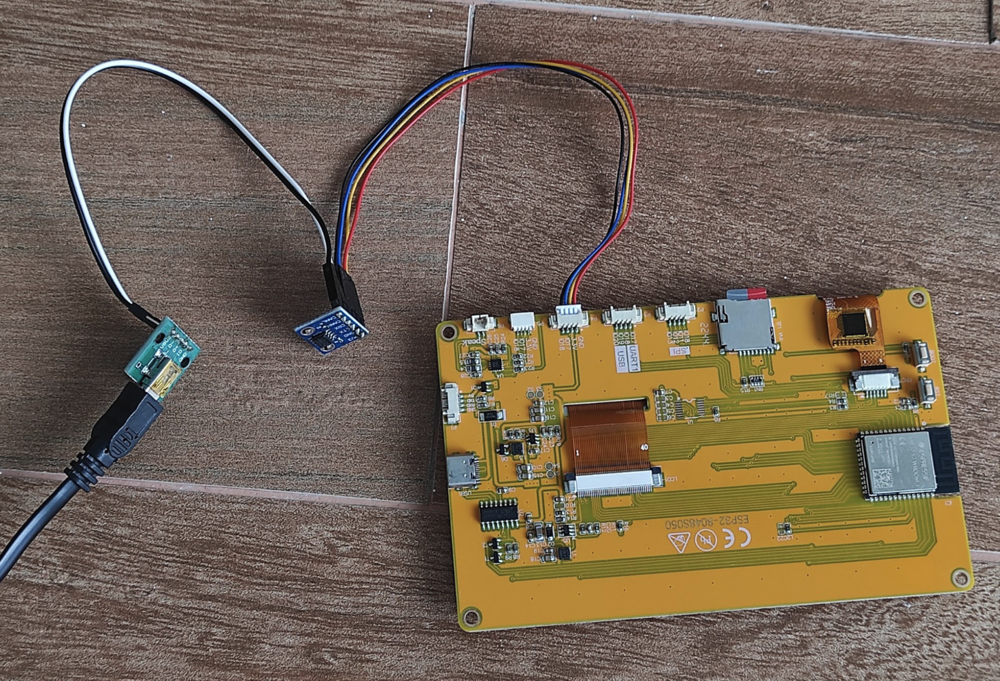
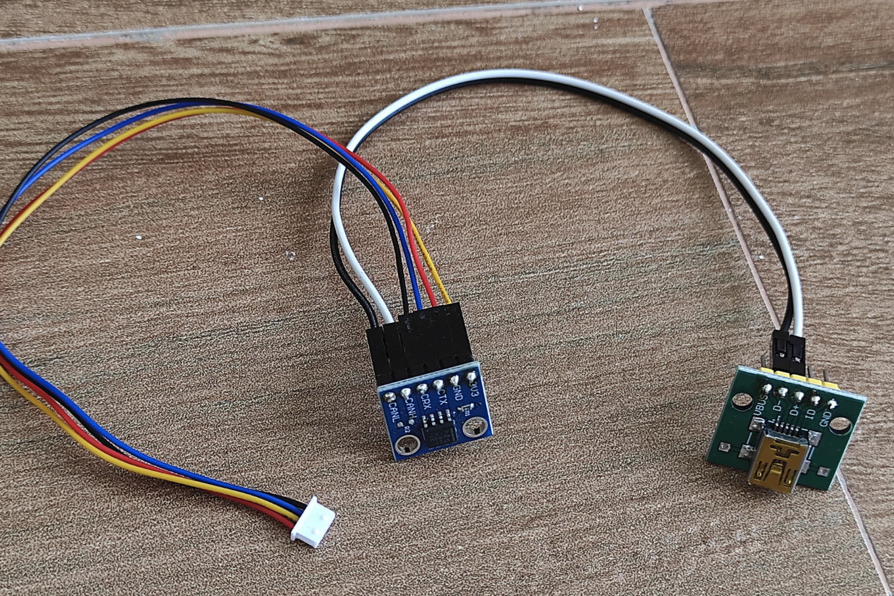
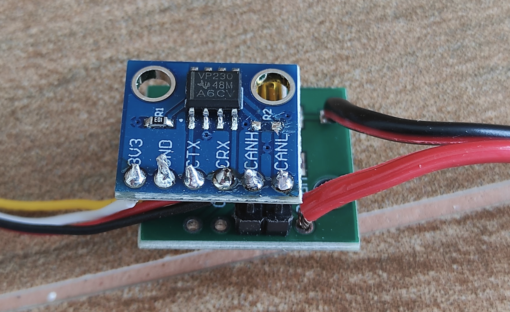

# ESP32OBD2
An embedded Javascript platform with OBD-II (CAN) and touch screen LCD support.
In the current version, it can retrieves some interesting information such as 
battery SoC/SoH, HV insulation resistance, etc. and display it on the LCD.

  

***Work in Progress***
- Needs better documents
- Better UI (menu, icon, etc)
- ISO-TP
- DTC view/clear
- Graphs/visualization
- Local logging on SD card or LittleFS
- The empty space on the left side of the screen is for menu buttons

**Compiling**
- Requires Arduino IDE, version 1.8.19
- Requires esp32 by Espressif Systems, version 2.0.11
- Requires GFX_Library for Arduino by Moon On Our Nation, version 1.3.7
- Requires TAMC_GT911 by TAMC, version 1.0.2
- Must increase the stack size in *sdkconfig.h*
  
   `~/Library/Arduino15/packages/esp32/hardware/esp32/2.0.11/tools/sdk/esp32s3/qio_opi/include/sdkconfig.h`
  
    `#define CONFIG_ARDUINO_LOOP_STACK_SIZE 16384`
- For bigger app/LittleFS/SPIFFS partition, edit  `~/Library/Arduino15/packages/esp32/hardware/esp32/2.0.11/boards.txt`

  esp32s3.menu.PartitionScheme.large_spiffs_16MB=Large SPIFFS 16MB (4.5MB APP/6.93MB SPIFFS)
  esp32s3.menu.PartitionScheme.large_spiffs_16MB.build.partitions=large_spiffs_16MB
  esp32s3.menu.PartitionScheme.large_spiffs_16MB.upload.maximum_size=4718592

**Logging of incoming CAN messages via UDP**
- Create `wifissid.txt`, `wifipass.txt`, `loghost.txt` and `logport.txt` on an SD card. Contains `WiFi SSID`, `WiFi password`, `UDP log server's IP` and `UDP log server's port` respectively
- Can be disabled by commenting out `#define UDP_LOG` in `config.h`

**Adapting to other cars**
- Edit gateway authentication functions in `auth.ino` and `data/firmware/auth.js`
- Edit list of requests, expected responses and how to interpret it in `data/firmware/display.js` 

**Hardware**
- ESP32S3-8048S050 (5 inch, 800x480 LCD, 16MB flash, 8MB PSRAM)
- CAN bus transceiver module (3.3V)
- OBD2 to Mini USB cable
- Mini USB breakout board

**Wiring**
- Remove 120 Ohm resister between CAN-H and CAN-L from the CAN bus transceiver (if available)
- Connect pin 6 and pin 14 of OBD2 connector to CAN-H and CAN-L of the transceiver, respectively
- Connect pin 14 of OBD2 connector to CAN-L of the transceiver
- From P4 of ESP32S3 board, connect IO17 and IO18 to TX and RX of the transceiver, respectively
- Connect supply power/ground

  
  
  
  
  
  
